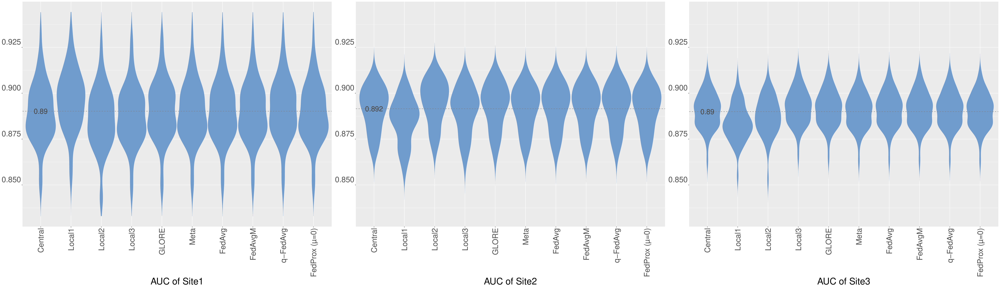
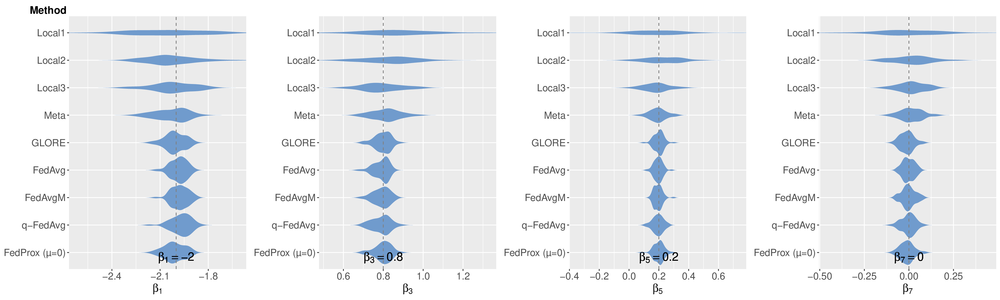

# Federated Learning for Clinical Structured Data: A Benchmark Comparison of Engineering and Statistical Approaches
- [Supplementary materials](#supplementary-materials)
- [Introduction](#introduction)
- [System requirements](#system-requirements)
- [A demo for generating and analyzing simulated data](#a-demo-for-generating-and-analyzing-simulated-data)
  - [Step I. Generate simulated data](#step-i-generate-simulated-data)
  - [Step II. Fit local and central models](#step-ii-generate-local-and-central-models)
  - [Step III. Fit FL models](#step-iii-generate-fl-models)
    - [(1). GLORE](#1-glore)
    - [(2). DAC \& SHIR](#2-dac-shir)
    - [(3). Flower (FedAvg, q-FedAvg \& FedAvgM)](#3-flower-fedavg-q-fedavg--fedavgm)
    - [(4). FedProx](#3-fedprox)
  - [Step IV. Result analysis](#step-iv-result-analysis)
- [Citation](#citation)
- [Contact](#contact)

R and Python workflow for generating and analyzing simulated datasets for benchmark comparisons of engineering-based FL algorithms ([FedAvg](https://arxiv.org/abs/1602.05629), [FedAvgM](https://arxiv.org/abs/1909.06335), [q-FedAvg](https://arxiv.org/abs/1905.10497) and [FedProx](https://arxiv.org/abs/1812.06127)) and the statistics-based FL algorithm ([GLORE](https://www.ncbi.nlm.nih.gov/pmc/articles/PMC3422844/), [DAC](https://academic.oup.com/biostatistics/article/23/2/397/5903572) and [SHIR](https://www.tandfonline.com/doi/full/10.1080/01621459.2021.1904958)). 

See our new [Preprint](https://arxiv.org/abs/2311.03417) for the whole story.

This repository incorporates some code from [FedProx](https://github.com/litian96/FedProx) and [GLORE](https://github.com/x1jiang/glore).

## Supplementary materials

<a href="Supplementary/FLB_algorithms_Supplement.pdf" download="FLB_supplmentary">Download</a> Supplementary materials

## Introduction

Federated Learning (FL) has shown promising potential for safeguarding data privacy in healthcare collaborations. Although the term “FL” was originally coined by engineers,  the statistical community has also explored similar privacy-preserving algorithms. Statistical FL algorithms, however, remain considerably less recognized than their engineering counterparts. Our goal was to bridge the gap by presenting the first comprehensive comparison of FL frameworks from both engineering and statistical domains. We evaluated five FL frameworks using both simulated and real-world data. The results indicate that statistical FL algorithms yield less biased point estimates for model coefficients and offer convenient confidence interval estimations. In contrast, engineering-based methods tend to generate more accurate predictions, sometimes surpassing central pooled and statistical FL models. This study underscores the relative strengths and weaknesses of both types of methods, emphasizing the need for increased awareness and their integration in future FL applications. 

## System requirements
- **R packages**: 'cowplot', 'dplyr', 'ggplot2', 'grid', 'gridExtra', 'pROC', 'rstudioapi', 'stringr'.
- **Java**: version 8 or higher.
- **Python**: version 3.9 (macOS) or 3.7 (Windows).
  
  To install the required Python packages, run: ```pip install -r requirements.txt``` (use `requirements_win.txt` for Windows).

**Extra notes for using TensorFlow:** The current version is for macOS. For Windows users, when importing Tensorflow, replace the current lines with `import tensorflow as tf`.

## A demo for generating and analyzing simulated data

In this section, we will walk through a demonstration of generating and analyzing simulated data using three clients (site 1, site 2, and site 3). 

### Step I. Generate simulated data

Run script `scripts/R/Sim/main.R` to generate 50 seeds of simulation, with the output saved in the `data/simulated` directory.

### Step II. Generate local and central models

- Run script `scripts/R/main.R` to produce local results. Point estimate results like `Coef.local.Site1.csv` are stored in each seed folder. 
- Run script `scripts/R/main.R` to produce global results. Point estimate results `Coef_central.csv` stored in each seed folder.
- Run script `scripts/R/main.R` to produce meta results. Point estimate results `Coef_meta.csv` stored in each seed folder.


### Step III. Generate FL models

#### (1). GLORE
- Run following commands to compile `Server.java` and `Client.java`.
```
cd scripts/GLORE
javac -cp Jama-1.0.2.jar Server.java Client.java
```
- Run script `run_glore.py` (macOS) or `run_glore_win.py` (Windows) to start the server and clients, with output file `output_glore.txt` stored in each seed folder.
```
python run_glore.py [path]
```
For example:
```
python run_glore.py ../../data/simulated/homogenous
```
- Run script `scripts/data_LR/extract_glore_all.py` to extract model coefficients and total training time for all datasets and seeds, with output files `Coef_glore.csv` and `Cov_glore.csv` stored in each seed folder.
```
cd scripts/data_LR
python extract_glore_all.py ../../data/simulated
```
#### (2). DAC & SHIR


#### (3). Flower (FedAvg, q-FedAvg & FedAvgM)
- Change strategies in `scripts/Flower/FL_run_win.py` (Windows) or `scripts/Flower/FL_run.py` (macOS) for different FL methods:
  - Strategy 1: FedAvg
  - Strategy 2: q-FedAvg
  - Strategy 3: FedAvgM
- Run script ```python scripts/Flower/run_flwr_all_win.py [path]``` for Windows and ```python scripts/Flower/run_flwr_all.py [path]``` for macOS, with output file `output_flwr_fedavg.txt` stored in each seed folder.

For example:
```
python scripts/Flower/run_flwr_all_win.py data/simulated/homogenous
```

- Run script ```python scripts/data_LR/extract_flower_fedavg.py [path]``` to extract coefficients and communication cost. The same for `scripts/data_LR/extract_flower_fedavgM.py` and `scripts/data_LR/extract_flower_Qfedavg.py`.
For example:
```
python scripts/data_LR/extract_flower_fedavg.py data/simulated/homogenous
```

#### (4). FedProx
- Convert training and testing data to JSON format and copy them to the correct FedProx input data folder.
```
cd scripts/data_LR
python convert_data_to_json.py ../../data/simulated
python move_data.py simulated ../../data/simulated/[path]
```
For example:
```
python move_data.py simulated ../../data/simulated/homogenous
```

- Run script `scripts/FedProx/fedprox.py`, with output files like `fedprox_lr0.01_drop0_mu0` stored in each seed folder.
```
cd scripts/FedProx
python fedprox.py simulated [dataset]
```
For example:
```
python fedprox.py simulated homogenous
```
- Run script ```python extract_fedprox.py [output path]``` to extract model coefficients and communication, with output files stored in each seed folder.
For example:
```
python extract_fedprox.py simulated
```

### Step IV. Result analysis
- AUC of prediction task
  - Run script `scripts/Evaluation/auc.R` to calculate AUC score for all methods, with results stored in `scripts/Evaluation/AUC`.
  - Run script `scripts/Evaluation/auc_eval.R` to draw violin plots for AUC values, with results stored in `scripts/Evaluation/AUC`.
  
- Coefficient estimate
  - Run script `scripts/Evaluation/coef_eval.R` to extract coefficients of all methods, with results stored in `scripts/Evaluation/Coef`.
  - Run script `scripts/Evaluation/coef_eval.R` to draw violin plots for estimated coefficients, with results stored in `scripts/Evaluation/Coef`.


- Communication

GLORE: Run script `scripts/Evaluation/extract_time.R` to extract communications for GLORE. 

DAC: The number of communication round is pre-decided by users, usually 3 is sufficient.

SHIR: SHIR is a one-shot FL algorithm.

FedAvg, FedAvgM, q-FedAvg and FedProx: The number of communication round is pre-decided by user through fine-tuning.

<!--The average round result will be generated at `scripts/Evaluation/time_rounds`.-->


## Citation

S. Li, et al. "Federated learning for clinical structured data: A benchmark comparison of engineering and statistical approaches." arXiv preprint arXiv:2311.03417 (2023).

## Contact

- Siqi Li (Email: <siqili@u.duke.nus.edu>)
- Nan Liu (Email: <liu.nan@duke-nus.edu.sg>)
